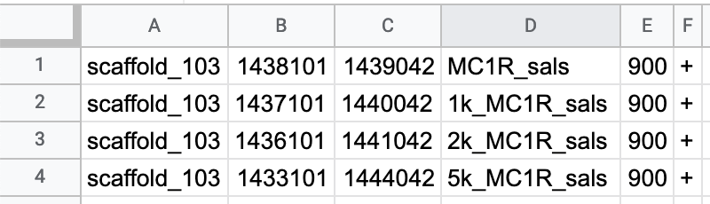

# Getting Nucleotide sequences from genes of interest
In progress tutorial for GECO

## 1. BLAST genes against genomes
Find the protein sequence of the desired gene. Lets use MC1R for this example. Go onto 
https://www.ncbi.nlm.nih.gov/ and lookup MC1R and select othologs to search the taxonomy tree for white throated sparrow or chicken and click the gene

Scroll down until you find the “mRNA and Protein(s)” section under “NCBI Reference Sequences (RefSeq)”  Click on the protein sequence (You’ll see either curated NP_ or non-curated XP_)  On this new protein page click FASTA to get the protein sequence. 
Download/make fasta file (for example I named it MC1R_chicken.fa)

### a. BLAST against common genome
Copy the sequence and go to  https://blast.ncbi.nlm.nih.gov/Blast.cgi 
Click tblastn and put the sequence in (to help keep track of jobs I also put the job name as the gene and species)
Change database to RefSeq Genome Database and species to “white-throated sparrow (taxid:44394)”
Then hit BLAST (it’ll take a few seconds to find the alignments)

Check alignments for best hit

### b. BLAST against custom genome:
Download and install blast on computer https://blast.ncbi.nlm.nih.gov/Blast.cgi?CMD=Web&PAGE_TYPE=BlastDocs&DOC_TYPE=Download
1. Make database for reference (example our sals genome “final.assembly.fasta”): 
```{bash eval=FALSE}
~/ncbi-blast-2.12.0+/bin/makeblastdb -dbtype nucl -in final.assembly.fasta -parse_seqids
```

2. BLAST query sequence (MC1R_chicken.fa) against custom genome (final.assembly.fasta):
```{bash eval=FALSE}
~/ncbi-blast-2.12.0+/bin/tblastn -db final.assembly.fasta -query MC1R_chicken.fa -out MC1R_chicken_vs_sals_sparrow_blastn.txt
```

Check alignments and take best hit

## 2. Getting Nucleotide sequences from protein sequences
In a new spreadsheet put the scaffold start and end locations of best hit. Add desired padding by subtracting from start and adding to end. 
File should look like this Make bed file by downloading as .tsv then renaming it



Download and install bedtools https://github.com/arq5x/bedtools2 
Use getfasta command to grab nucleotide sequences from the locations in the bed file.
```{bash eval=FALSE}
bedtools getfasta -fi final.assembly.fasta -bed MC1R_sals_sites.bed > MC1R_all_sals_Sequences.txt
```
